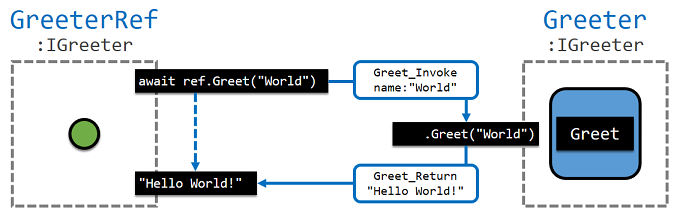

## Communicating with an actor

For every interface, `*Ref` class is generated and you can
send and receive a message from an interfaced actor with this reference
class.

<p align="center">
  <br/>
  *Figure: `Greet` request is sent to `Greeter` using `Greet` method of `GreeterRef`.*
</p>

For example, `GreeterRef` is generated for interface `IGreeter`.

```csharp
public class GreeterRef : InterfacedActorRef, IGreeter
{
    public GreeterRef(IActorRef actor) { ... }
    public Task<string> Greet(string name) { ... }
    public Task<int> GetCount() { ... }
    ...
}
```

This is a proxy reference and when you call a method of interface,
it packs all parameter into a message, sends it to an target actor and
waits for a response. You can use it as following:

```csharp
var greeter = new GreeterRef(actor);
var hello = await greeter.Greet("Actor");  // send Greet and waits for a response
var count = await greeter.GetCount();      // send GetCount and waits for a response
```

#### RequestWaiter

`Ref` class needs a `RequestWaiter` which is a request context
for receiving a response.
Default one is `AkkaAskRequestWaiter` which uses `Ask` method for `IActorRef`.

```csharp
var greeter = new GreeterRef(a);       // RequestWaiter is AkkaAskRequestWaiter
await greeter.Greet("Actor");          // create a temporary actor and
                                       // waits for a response with it
```

Because `Ask` always creates a temporary actor for waiting for a response,
it is better for an interfaced actor to have its own request context.

```csharp
var greeter = new GreeterRef(a, this); // RequestWaiter is this
await greeter.Greet("Actor");          // does not create a temporary actor and
                                       // waits for a response with this
```

So when you get `Ref` and will use in an interfaced actor, it's a good idea to
set `RequestWaiter`as this like following:

```csharp
var greeter = GetActorFromSomewhere();
greeter = greeter.WithRequestWaiter(this);
```

#### Timeout

Target actor can be busy or hosting server can be down. Without timeout, you
need to wait long time or indefinitely in vain.

```csharp
var greeter = new GreeterRef(actor);   // actor goes wrong
await greeter.Greet("Actor");          // waits indefinitely
```

Timeout can be set with constructor or `WithTimeout`.

```csharp
// create Ref with 3 seconds timeout
var greeter = new GreeterRef(actor, this, TimeSpan.FromSeconds(3));
// send a Greet request with 1 second timeout
await greeter.WithTimeout(TimeSpan.FromSeconds(1)).Greet("Actor");
```

When a request hits timeout, `TaskCanceledException` is thrown.

```csharp
var greeter = new GreeterRef(actor, this, TimeSpan.FromSeconds(3));
await greeter.Greet("Actor"); // TaskCanceledException is thrown at timeout
```

#### Fire-and-Forget

Sending a request always requires you to wait for a response even when the
return type of method is `void`. When you get response of void, you can safely
assume that target actor gets a request and handles it successfully.

Sometimes you just only want to send a request like following but a compiler
starts to complain it.

```csharp
var greeter = new GreeterRef(actor);
greeter.Greet("Actor");
// warning CS4014:
//   Because this call is not awaited, execution of the current method continues
//   before the call is completed. Consider applying the 'await' operator to the result of the call.
```

Instead of depressing `CS4014` warning, you can use `WithNoReply` method.

```csharp
var greeter = new GreeterRef(actor);
greeter.WithNoReply().Greet("Actor");
```

It just sends a request message and moves on.
