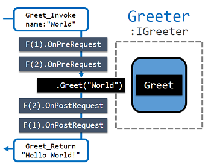

## Filter

Filter are instances that run code before or after handling request, message and
notification. It allows you to log or manipulate specific messages.

<p align="center">
  <br/>
  *Figure: Filter run code before or after main handler.*
</p>

For example, folloing `MyActor` uses two filter.
One is `Log` filter to capture all requests, message and notifications.
The other is `Authroized` filter to restrict access to authorized users.  

```csharp
[Log]
class MyActor : InterfacedActor, IGreeterSync, IAuthorizable
{
     string IGreeterSync.Greet(string name) { ... }
     [Authorized] int IGreeterSync.GetCount() { ... }
 }
```

#### Factory

Before an actor starts, it initializes a filter chain of its handlers.
A filter factory creates filters for constructing a filter chain.  

For example, previous `Log` filter is created by factory `LogAttribute`.
This factory will create a `Log` filter instance for every method of class and
you can keep `actorType` and `method` state and make use of them.

```csharp
class LogAttribute : Attribute, IFilterPerClassMethodFactory
{
    public void Setup(Type actorType, MethodInfo method) { ... }
    public IFilter CreateInstance() => new LogFilter(...);
}
```

There are 5 factory interfaces for controlling how a filter instance will be
created.

  - `IFilterPerClassFactory`: Create a filter per a class
  - `IFilterPerClassMethodFactory`: Create a filter per a method of class
  - `IFilterPerInstanceFactory`: Create a filter per an instance
  - `IFilterPerInstanceMethodFactory`: Create a filter per a method of an instance
  - `IFilterPerInvokeFactory`: Create a filter for every invocation.

`IFilterPerClassFactory` and `IFilterPerClassMethodFactory` create a filter which
is shared by multiple instances and can be executed simultaneously.
Therefore, you may prepare race condition.   

#### What and when

Filters can run code on request, notification, and message and can be executed
before or after those messages.
For example, a filter which implements `IPreRequestFilter` will be executed
before handling a request and a filter which implements `IPostNotificationFilter`
will be executed after handling a notification.

Filters can have multiple handlers. For example, `LogFilter` has 4 handlers to
log all possible messages.

```csharp
class LogFilters : IPreRequestFilter, IPostRequestFilter, IPreMessageFilter, IPreNotificationFilter
{ ... }
```

All filters support both synchronous and asynchronous implementations.
For example, `IPreRequestAsyncFilter` is an asynchronous one of `IPreRequestFilter`.

#### Ordering

Multiple filters can be executed for one message and execution order is based on
`Order` property of filter.

- For pre-filters, a filter that has the lowest order runs first.
- For post-filters, a filter that has the highest order rusn first.  

For examples, if there are A filter whose order is 1 and B filter whose order is 2,
they run in order like:

```
A.Pre -> B.Pre -> Handler -> B.Post -> A.Post
```

#### Blocking handler

When a pre-filter makes context `handled`, main handler is not executed.
For example, following `AuthorizedFilter` is a pre-request filter that runs
`OnPreRequest` method before main handler.
It checks whether request is from an authroized actor and stops handling if not.

```csharp
class AuthorizedFilter : IPreRequestFilter
{
    void IPreRequestFilter.OnPreRequest(PreRequestFilterContext context)
    {
        if (context.Handled) return;

        var actor = (IAuthorizable)context.Actor;
        if (actor == null || actor.Authorized == false)
        {
            context.Response = new ResponseMessage
            {
                RequestId = context.Request.RequestId,
                Exception = new InvalidOperationException("Not enough permission.")
            };
            return;
        }
    }
}
```

A thing you should know is that filters will execute code even if one of previous filters
set context `handled` unlike main handler.
Because of this, you may need to check `context.Handled` at filter handler.
